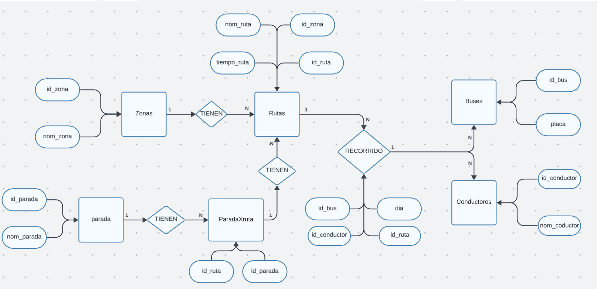
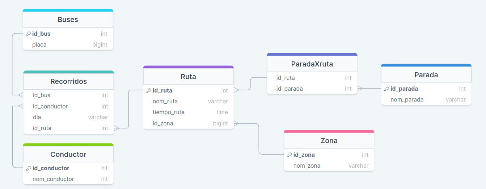

# Proyecto-Base-de-datos
### Sergio Alejandro Gonzalez Silva
### GRUPO R4
#### MODELO ENTIDAD RELACION

***
#### MODELO RELACIONAL

***
#### Creacion base de datos:
~~~sql
    CREATE DATABASE transporte;
~~~
***
#### Ingreso a la base de datos:
~~~sql
    use transporte;
~~~
***
#### Borrar bases de datos:
~~~sql
    DROP TABLE IF EXISTS Buses, Zona, Parada, ParadaXruta, Conductor, Ruta, Recorridos;
~~~
***
#### Creacion de las tablas:
~~~sql
CREATE TABLE `Buses`(
    `id_bus` INT UNSIGNED NOT NULL PRIMARY KEY,
    `placa` VARCHAR(50)
); 
CREATE TABLE `Zona`(
    `id_zona` INT UNSIGNED NOT NULL PRIMARY KEY,
    `nom_zona` VARCHAR(100) NOT NULL
);

CREATE TABLE `Parada`(
    `id_parada` INT UNSIGNED NOT NULL PRIMARY KEY,
    `nom_parada` VARCHAR(100) NOT NULL
);

CREATE TABLE `ParadaXruta`(
    `id_ruta` INT UNSIGNED NOT NULL,
    `id_parada` INT UNSIGNED NOT NULL,
    FOREIGN KEY(`id_parada`) REFERENCES `Parada`(`id_parada`)
);

CREATE TABLE `Conductor`(
    `id_conductor` INT UNSIGNED NOT NULL PRIMARY KEY,
    `nom_conductor` VARCHAR(100)  NOT NULL
);

CREATE TABLE `Ruta`(
    `id_ruta` INT UNSIGNED NOT NULL PRIMARY KEY,
    `nom_ruta` VARCHAR(100) NOT NULL,
    `tiempo_ruta` TIME NOT NULL,
    `id_zona` INT UNSIGNED,
    FOREIGN KEY(`id_zona`) REFERENCES `Zona`(`id_zona`)
);

CREATE TABLE `Recorridos`(
    `id_bus` INT UNSIGNED NOT NULL,
    `id_conductor` INT UNSIGNED NOT NULL,
    `dia` VARCHAR(100) NOT NULL,
    `id_ruta` INT UNSIGNED NOT NULL,
    FOREIGN KEY(`id_conductor`) REFERENCES `Conductor`(`id_conductor`),
    FOREIGN KEY(`id_bus`) REFERENCES `Buses`(`id_bus`),
    FOREIGN KEY(`id_ruta`) REFERENCES `Ruta`(`id_ruta`)
);
~~~
